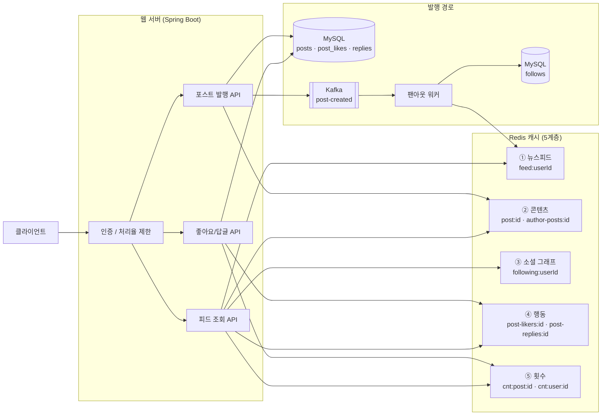
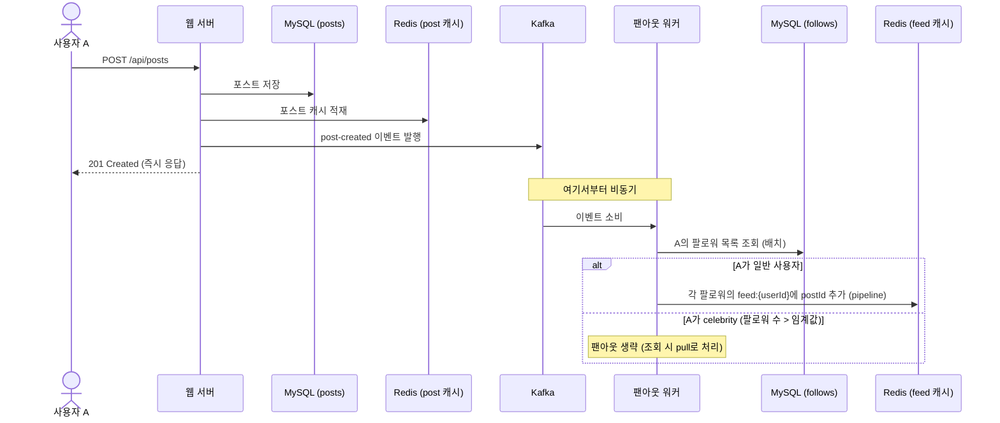
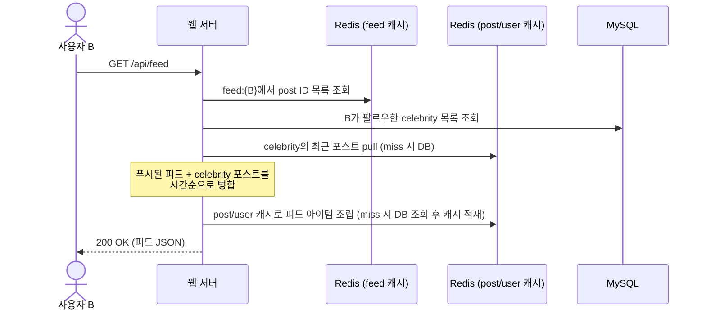

# 2. 개략적 설계 (High-Level Design)

뉴스피드 시스템은 크게 두 가지 흐름으로 나뉜다.

1. **피드 발행 (Feed Publishing)** — 포스트를 저장하고 팔로워들의 피드 캐시에 전파(팬아웃)
2. **뉴스피드 생성 (Newsfeed Building)** — 사용자가 피드를 요청하면 캐시에서 조립해 응답

## 2.1 전체 아키텍처

## 2.2 피드 발행 흐름 (Fanout-on-Write)

사용자가 포스트를 발행하면, **비동기적으로** 팔로워들의 피드 캐시에 포스트 ID를 밀어 넣는다.

**핵심 포인트**
- 발행 API는 DB 저장 + 이벤트 발행까지만 하고 즉시 응답한다. 팬아웃은 워커가 비동기로 처리 → 발행 지연이 팔로워 수와 무관해진다.
- 메시지 큐(Kafka)가 발행 경로와 팬아웃 경로를 **분리(decouple)** 한다. 워커가 느려도 발행은 영향받지 않고, 워커를 수평 확장할 수 있다.

## 2.3 뉴스피드 조회 흐름 (하이브리드)

**핵심 포인트**
- 대부분의 포스트는 이미 캐시에 푸시되어 있어(fanout-on-write) 조회가 빠르다.
- celebrity 포스트만 조회 시점에 읽어와(fanout-on-read) 병합한다.
- 피드 캐시에는 **post ID만** 저장한다. 본문/작성자 정보는 별도 캐시에서 조립 → 메모리 절약, 수정 시 정합성 관리 용이.
- 좋아요/답글 횟수와 likedByMe도 조회 시점에 행동·횟수 캐시에서 조립한다. 좋아요가 눌릴 때마다 팔로워들의 피드 캐시를 갱신할 필요가 없다.

## 2.4 저장소 선택

| 데이터 | 저장소 | 이유 |
|--------|--------|------|
| 포스트, 사용자, 팔로우, 좋아요, 답글 | MySQL | 관계형 데이터, 영속성의 원천(source of truth) |
| 뉴스피드 (post ID 목록) | Redis Sorted Set | 시간순 정렬 + 범위 조회 + 상한 유지가 자료구조로 자연스럽게 해결됨 |
| 포스트/사용자 상세, 소셜 그래프, 행동 | Redis (look-aside) | read-heavy 워크로드에서 DB 부하 차단 |
| 좋아요·답글·팔로어 횟수 | MySQL 비정규화 컬럼 + Redis Hash | `COUNT(*)` 회피. 원천은 행, 컬럼·캐시는 파생값 ([03-detailed-design.md](03-detailed-design.md) §3.2) |
| 이벤트 스트림 | Kafka | 발행/팬아웃 분리, 컨슈머 수평 확장, 재처리 가능 |

> 책에서는 친구 관계에 그래프 DB를 제안하지만, 이 프로젝트는 1-depth 관계(내 팔로워/팔로잉 목록)만 필요하므로 RDB 테이블로 충분하다. 상세 근거는 [03-detailed-design.md](03-detailed-design.md) 참고.
